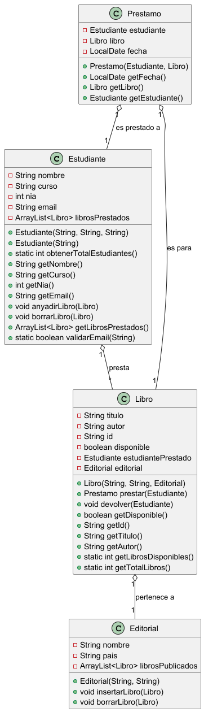

# Servicio de compra online en MERCADAW

## ÍNDICE

1. [Resumen](#resumen)
2. [Estructura de clases](https://github.com/pbendom3/Repositorio_Estructuras/tree/main#estructura-de-clases)
    - [Diagrama UML](#diagrama-uml)
    - [Código de PlantUML](#codigo-de-plantuml)
4. [Programa principal AppZonaclientes](#programa-principal-appzonaclientes)
5. [Pruebas](#pruebas)
6. [Entrega](#entrega)


## Resumen
> Esta app consiste en implementar la funcionalidad de una compra online ficticia en Mercadam.

El programa se divide en dos partes:
- **App de Mantenimiento**.[en proceso]
- **App Zona de Clientes** para autenticarse y realizar pedidos. 

## Estructura de clases 

Utilizaremos Programación Orientada a Objetos (POO) y la siguiente estructura:

### Diagrama UML


### Código de PlantUML

```` PlantUML
@startuml

class Estudiante {
    - String nombre
    - String curso
    - int nia
    - String email
    - ArrayList<Libro> librosPrestados
    + Estudiante(String, String, String)
    + Estudiante(String)
    + static int obtenerTotalEstudiantes()
    + String getNombre()
    + String getCurso()
    + int getNia()
    + String getEmail()
    + void anyadirLibro(Libro)
    + void borrarLibro(Libro)
    + ArrayList<Libro> getLibrosPrestados()
    + static boolean validarEmail(String)
}

class Libro {
    - String titulo
    - String autor
    - String id
    - boolean disponible
    - Estudiante estudiantePrestado
    - Editorial editorial
    + Libro(String, String, Editorial)
    + Prestamo prestar(Estudiante)
    + void devolver(Estudiante)
    + boolean getDisponible()
    + String getId()
    + String getTitulo()
    + String getAutor()
    + static int getLibrosDisponibles()
    + static int getTotalLibros()
}

class Prestamo {
    - Estudiante estudiante
    - Libro libro
    - LocalDate fecha
    + Prestamo(Estudiante, Libro)
    + LocalDate getFecha()
    + Libro getLibro()
    + Estudiante getEstudiante()
}

class Editorial {
    - String nombre
    - String pais
    - ArrayList<Libro> librosPublicados
    + Editorial(String, String)
    + void insertarLibro(Libro)
    + void borrarLibro(Libro)
}

Estudiante "1" o-- "*" Libro : "presta"
Libro "1" o-- "1" Editorial : "pertenece a"
Prestamo "1" o-- "1" Estudiante : "es prestado a"
Prestamo "1" o-- "1" Libro : "es para"

@enduml

````
**Clase Cliente**
```` Java
package org.example.inmutabilidad;
import java.util.ArrayList;
import java.util.Arrays;
import java.util.Collections;
import java.util.List;

public class Arbitro {

    List<String> lista = new ArrayList<>(Arrays.asList("Gil Manzano","Negreira", "Clos Gómez"));

    public List<String> getLista (){
        return Collections.unmodifiableList(lista);
    }

    @Override
    public String toString() {
        return "Arbitro{" +
                "lista=" + lista +
                '}';
    }
}

````


## Programa principal AppZonaclientes

## Pruebas

## Entrega
