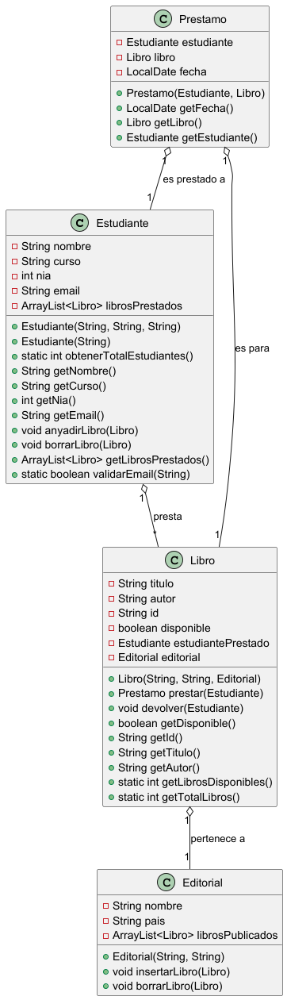

# Servicio de compra online en MERCADAW

## ÍNDICE

1. [Resumen](#resumen)
2. [Estructura de clases](https://github.com/pbendom3/Repositorio_Estructuras/tree/main#estructura-de-clases)
    - [Diagrama UML](#diagrama-uml)
    - Código de PlantUML
    - Clase Cliente
    - Clase Pedido
    - Enum Producto
4. [Programa principal AppZonaclientes](#programa-principal-appzonaclientes)
5. [Pruebas](#pruebas)
6. [Entrega](#entrega)

## Resumen
> Esta app consiste en implementar la funcionalidad de una compra online ficticia en Mercadam.

El programa se divide en dos partes:
- **App de Mantenimiento**.[en proceso]
- **App Zona de Clientes** para autenticarse y realizar pedidos.

## Estructura de clases

Utilizaremos Programación Orientada a Objetos (POO) y la siguiente estructura:

### Diagrama UML

## Programa principal AppZonaclientes

## Pruebas

## Entrega